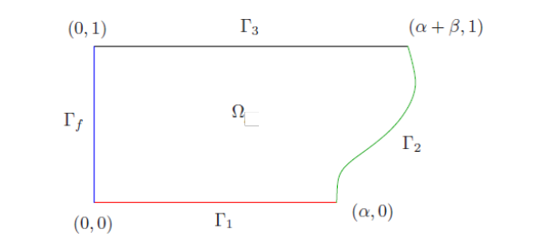
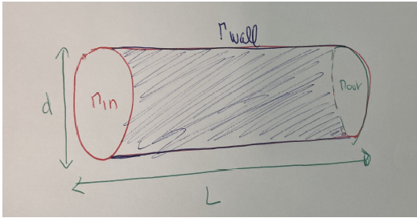

# 1. Résolution d'un problème de transfert de chaleur :

Soit $\Omega$ un domaine borné suffisamment régulier, on considère le problème :

$$
\begin{cases}
    -k \Delta \phi + \vec{u} \cdot \nabla \phi = 0 & \text{dans } \Omega, \\
    \phi = 0 & \text{sur } \Gamma_c, \\
    \phi = 1 & \text{sur } \Gamma_H, \\
    \nabla \phi \cdot \vec{n} = 0 & \text{sur } \Gamma_w.
\end{cases}
$$

Le domaine $\Omega$ est illustré comme suit :

<figcaption style="text-align: center; font-weight: bold;">
Figure 1 – Illustration du domaine $\Omega$.
</figcaption>

Illustration du domaine ($\Omega$)

## Formulation Variationnelle

Soit $\Omega$ un domaine borné suffisamment régulier, on cherche $\phi \in H^1(\Omega)$ tel que :

1. $\phi = 0$ sur $\Gamma_c$ (condition de Dirichlet).
2. Pour tout $v \in H^1_0(\Omega)$, on a l'égalité suivante :

$$
\int_\Omega k \nabla \phi \cdot \nabla v \, dx + \int_\Omega (\vec{u} \cdot \nabla \phi) v \, dx = 0
$$

où :

- $H^1(\Omega)$ est l'espace de Sobolev.
- $H^1_0(\Omega)$ est le sous-espace de $H^1(\Omega)$ des fonctions nulles sur $\Gamma_c$.

Les conditions aux limites sont intégrées dans les espaces fonctionnels ou directement dans l'intégrale.

- $\Gamma_H$ impose $\phi = 1$ (on peut ajuster ce terme en tenant compte des conditions de Dirichlet avec des fonctions de test modifiées).
- $\Gamma_w$ impose $\nabla \phi \cdot \vec{n} = 0$ et est prise en compte naturellement dans le cadre variationnel, car elle correspond à une condition de Neumann homogène.

D'où :

$$
a(\phi, v) = \int_\Omega k \nabla \phi \cdot \nabla v \, dx + \int_\Omega (\vec{u} \cdot \nabla \phi) v \, dx
$$

et

$$
l(v) = 0.
$$

## Problème des Éléments Finis

Pour $\Gamma_c = \Gamma_f$, $\Gamma_H = \Gamma_2$, et $\Gamma_w = \Gamma_1 \cup \Gamma_3$ :

- Cas 1 : $k = 0.01$ et $\vec{u} = \vec{0}$.
- Cas 2 : $k = 0.01$ et $\vec{u} = (0.1, 0)$.

Nous cherchons à résoudre le problème défini précédemment dans **FreeFem++** en utilisant des éléments finis **P1** sur l'un des maillages, par exemple, le maillage 4 avec $h = 0.1$.

## Étude de convergence :

Pour le **cas 1**, nous allons étudier la convergence. On note $\phi_{\text{ref}}$ la solution de référence du problème précédent sur le maillage 1, et $\phi_2$, $\phi_3$, $\phi_4$ les solutions obtenues respectivement sur les maillages 2, 3 et 4.

Les erreurs absolues et relatives, pour $i = 2, 3, 4$, sont définies par :

$$
E_i^A = \phi_{\text{ref}} - \Pi_1^i \phi_i \quad \text{et} \quad E_i^R = \frac{\| E_i^A \|}{\| \phi_{\text{ref}} \|_{L^2(\Omega)}}
$$

où $\Pi_1^i$ est l'opérateur d'interpolation de l'espace des éléments finis associé au maillage $i$ vers l'espace des éléments finis associé au maillage 1.

# 2. Résolution d'un problème d’écoulement d’eau (problème 2D)

L'objectif est de résoudre un problème d’écoulement d’eau dans une canalisation de diamètre $d$ et de longueur $L$.

Soit $\Omega = [0, L] \times [0, d]$ avec $\partial \Omega = \Gamma_{\text{in}} \cup \Gamma_{\text{out}} \cup \Gamma_{\text{wall}}$ et 

- $\Gamma_{\text{in}} = \{x = 0, y \in [0, d]\}$
- $\Gamma_{\text{out}} = \{x = L, y \in [0, d]\}$
- $\Gamma_{\text{wall}} = \{x \in [0, L], y = 0\} \cup \{x \in [0, L], y = d\}$

On considère le problème suivant : On cherche $\vec{u} = \begin{pmatrix} u_x \\ u_y \end{pmatrix}$ et $p$ tels que :

$
\begin{cases}
\mu \Delta \vec{u} + \nabla p = \vec{f} & \text{dans } \Omega, \\
\nabla \cdot \vec{u} = 0 & \text{dans } \Omega, \\
\vec{u} = \vec{0} & \text{sur } \Gamma_{\text{wall}}, \\
\vec{u} = \vec{u}_{\text{in}} & \text{sur } \Gamma_{\text{in}}, \\
\nabla \vec{u} \cdot \vec{n} = 0 & \text{sur } \Gamma_{\text{out}}.
\end{cases}
$

où $\vec{f} = \begin{pmatrix} f_x \\ f_y \end{pmatrix}$, $\vec{0} = \begin{pmatrix} 0 \\ 0 \end{pmatrix}$ et $\vec{u}_{\text{in}} = \begin{pmatrix} u_x^{\text{in}} \\ u_y^{\text{in}} \end{pmatrix}$.

**Remarque** : $u_x^{\text{in}}$ et $u_y^{\text{in}}$ ne sont pas forcément à valeurs constantes dans $\Gamma_{\text{in}}$.

## Formulation Variationnelle

Nous cherchons à résoudre le système suivant pour $\vec{u} = \begin{pmatrix} u_x \\ u_y \end{pmatrix}$ et $p$ :

$$
\begin{aligned}
a(\vec{u}, \vec{v}) - b(\vec{v}, p) &= l(\vec{v}), \quad \forall \vec{v} \in \vec{V}, \\
b(\vec{u}, q) &= 0, \quad \forall q \in Q,
\end{aligned}
$$

où $\vec{v} = \begin{pmatrix} v_x \\ v_y \end{pmatrix}$ est la fonction test associée à $\vec{u}$, et $q$ est la fonction test associée à $p$.

Système d'équations de l'EDP :

On peut réécrire le système d'équations suivant sous forme de système d'EDP :

$$
\begin{aligned}
-\mu \Delta u_x + \frac{\partial p}{\partial x} &= f_x, \\
-\mu \Delta u_y + \frac{\partial p}{\partial y} &= f_y, \\
\nabla \cdot \vec{u} &= 0.
\end{aligned}
$$

En intégrant par parties, nous obtenons la formulation variationnelle du problème :

$$
\begin{aligned}
-\mu \int_\Omega \Delta u_x v_x \, \mathrm{d}\Omega + \int_\Omega \frac{\partial p}{\partial x} v_x \, \mathrm{d}\Omega &= \int_\Omega f_x v_x \, \mathrm{d}\Omega, \\
-\mu \int_\Omega \Delta u_y v_y \, \mathrm{d}\Omega + \int_\Omega \frac{\partial p}{\partial y} v_y \, \mathrm{d}\Omega &= \int_\Omega f_y v_y \, \mathrm{d}\Omega, \\
\nabla \cdot \vec{u} \, q &= 0.
\end{aligned}
$$

Intégration par parties : 

En utilisant l'intégration par parties, on peut transformer certains termes. On a l'identité suivante pour les termes contenant le gradient de $p$ :

$$
\int_\Omega (\nabla p \cdot \vec{v}) \, \mathrm{d}\Omega = \int_\Omega \left( \nabla \cdot (p \vec{v}) - p (\nabla \cdot \vec{v}) \right) \, \mathrm{d}\Omega.
$$

Par la formule de Stokes, on peut exprimer le terme $\nabla \cdot (p \vec{v})$ comme une intégrale sur le bord de $\Omega$ :

$$
\int_\Omega \nabla \cdot (p \vec{v}) \, \mathrm{d}\Omega = \int_{\partial \Omega} \vec{n} \cdot p \vec{v} \, \mathrm{d}\partial \Omega.
$$

Ainsi, on obtient également :

$$
\int_{\partial \Omega} \vec{n} \cdot \nabla p \, \vec{v} = 0.
$$

$$
a(\vec{u}, \vec{v}) = \int_\Omega \mu \nabla \vec{u} : \nabla \vec{v} \, \mathrm{d}\Omega,
$$

$$
b(\vec{v}, p) = \int_\Omega (\nabla \cdot \vec{v}) p \, \mathrm{d}\Omega,
$$

$$
l(\vec{v}) = \int_\Omega \vec{f} \cdot \vec{v} \, \mathrm{d}\Omega.
$$

Enfin, la formulation discrétisée du problème devient :

$$
\begin{aligned}
a(\vec{u}, \vec{v}) - b(\vec{v}, p) &= l(\vec{v}), \quad \forall \vec{v} \in \vec{V}, \\
b(\vec{u}, q) &= 0, \quad \forall q \in Q,
\end{aligned}
$$

où les espaces fonctionnels sont définis comme suit :

- $\vec{V} = \{ \vec{v} \in H^1(\Omega)^2 \mid \vec{v} = \vec{0} \text{ sur } \Gamma_{\text{wall}}, \, \vec{v} = \vec{u}_{\text{in}} \text{ sur } \Gamma_{\text{in}} \}$,
- $Q = L^2(\Omega)$.

avec : 
- $\nabla \vec{u} : \nabla \vec{v} = \mathrm{tr}(\nabla \vec{u}^T \nabla \vec{v})$ = $\sum_{i,j} \frac{\partial u_i}{\partial x_j} \frac{\partial v_i}{\partial x_j}$ (produit scalaire des tenseurs gradients)
- $\nabla \cdot \vec{v}$ = $div(v)$

## Problème des Éléments Finis

Soit les espaces des fonctions de base pour les éléments finis définis par :

- **$X_h$** : l'ensemble des fonctions $v \in H^1(\Omega)$ telles que pour tout élément $K \in T_h$, $v$ restreint à $K$ appartient à $P_1(K)$, où $P_1(K)$ désigne l'ensemble des polynômes de degré 1 sur l'élément $K$.
  
  $$ X_h = \left\{ v \in H^1(\Omega) \mid \forall K \in T_h, \, v|_K \in P_1(K) \right\} $$

- **$P_h$** : l'ensemble des fonctions $p \in L^2(\Omega)$ telles que pour tout élément $K \in T_h$, $p$ restreint à $K$ appartient à $P_0(K)$, où $P_0(K)$ désigne l'ensemble des polynômes de degré 0 (c'est-à-dire des fonctions constantes) sur l'élément $K$.

  $$ P_h = \left\{ p \in L^2(\Omega) \mid \forall K \in T_h, \, p|_K \in P_0(K) \right\} $$

Pour les fonctionnelles vectorielles, on définit l'espace **$V_h$** comme suit :

- **$V_h$** : l'ensemble des vecteurs de la forme $\vec{v} = (v_x, v_y, p)$ où $v_x \in X_h$, $v_y \in X_h$, et $p \in P_h$.

  $$ V_h = \left\{ \vec{v} = (v_x, v_y, p) \mid v_x \in X_h, v_y \in X_h, p \in P_h \right\} $$

Nous allons résoudre le problème défini précédemment avec les paramètres suivants :
- $d = 0.1$,
- $L = 1$,
- $h = 0.01$.
- $\mu = 0.1$
- $\vec{f} = \vec{0}$
- $u_x^{\text{in}} = 1 - \frac{(y - \frac{d}{2})^2}{\left( \frac{d}{2} \right)^2}$ et $u_y^{\text{in}} = 0$

On peut écrire le problème des éléments finis sous forme d'une seule équation en combinant les deux équations. Pour cela, on additionne les deux équations et on obtient :

$$
\int_\Omega \mu \nabla \vec{u} : \nabla \vec{v} \, \mathrm{d}\Omega - \int_\Omega p \times div(v) \, \mathrm{d}\Omega + \int_\Omega div(u) \times q \, \mathrm{d}\Omega = \int_\Omega \vec{f}^T \vec{v} \, \mathrm{d}\Omega
$$

$$
\int_\Omega \mu \left( \nabla u_x^T \nabla v_x + \nabla u_y^T \nabla v_y \right) - \int_\Omega \left( \frac{\partial v_x}{\partial x} + \frac{\partial v_y}{\partial y} \right) p + \int_\Omega \left( \frac{\partial u_x}{\partial x} + \frac{\partial u_y}{\partial y} \right) q = \int_\Omega f_x v_x + f_y v_y
$$

**Remarque** : On observe que le cas des éléments finis $P_2$-$P_1$ est stable, tandis que le cas $P_1$-$P_0$ ne l'est pas.

# 3. Extension en 3D

Nous étendons maintenant le problème en 3D en utilisant des éléments finis **P1** pour les composantes \( u_x \), \( u_y \), et \( u_z \) du champ de vitesse \( \vec{u} \), et des éléments finis **P0** pour la pression \( p \).

La géométrie du domaine \(\Omega\) est représentée ci-dessous :

<figcaption style="text-align: center; font-weight: bold;">
Figure 2 – Représentation du domaine pour l'extension en 3D.
</figcaption>
